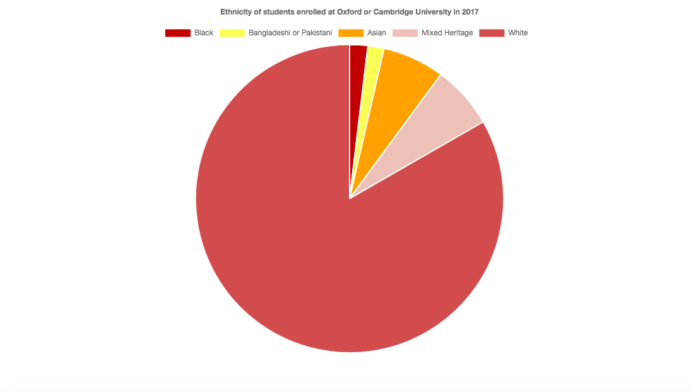

The number of black students applying for and accepting places at the Universities of Oxford and Cambridge is chronically low.

In 2017, black students represented a mere 1.9% of students who accepted a place at one of the two prestigious universities.

However, this was an improvement on the < 0.5% uptake of black students at Oxford University in 1997.

Oxford and Cambridge said they are working to broaden their pool of applicants and improve diversity.

The following pie chart shows the ethnicities of students who matriculated at the University of Oxford in 2017.

