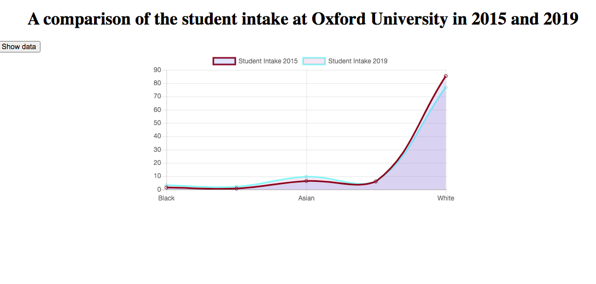
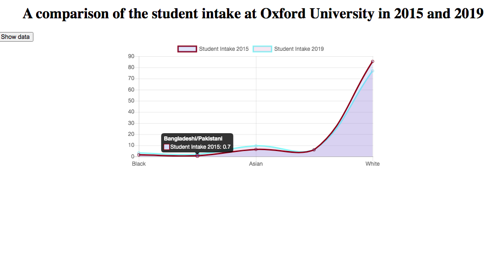
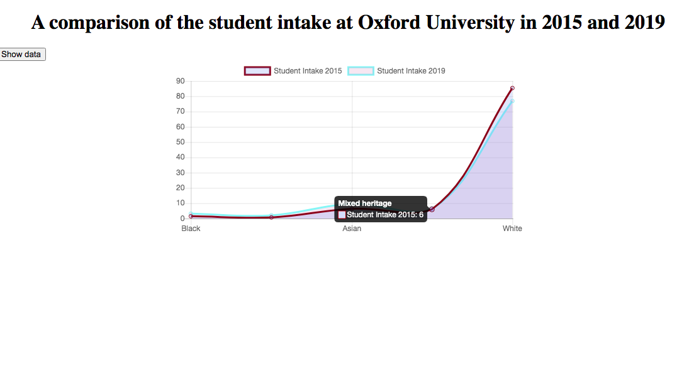

# A comparison of the ethnicities of students who matriculated at the University of Oxford in 2015 and 2019

## How to use

* To see the graph animation in the browser, clone this whole repository.
* Cd into the folder called Oxfordintake20172019
* Run the following to install the dependencies:
```html
npm install
```
* Run:
```html
npm start
```
* Enter the following into the browser:
```html
localhost:3000/data
```
* Click on the show dat button to see the animation

### Side Note

(The npm package json-server has been used to create a mock REST API)


The following line graph shows the ethnicities of students who matriculated at the University of Oxford in 2015 and 2019.

The graph shows that marginally more black students enrolled at the University in 2019 than did in 2015, and fewer white students matriculated in 2019 than did in 2015.




