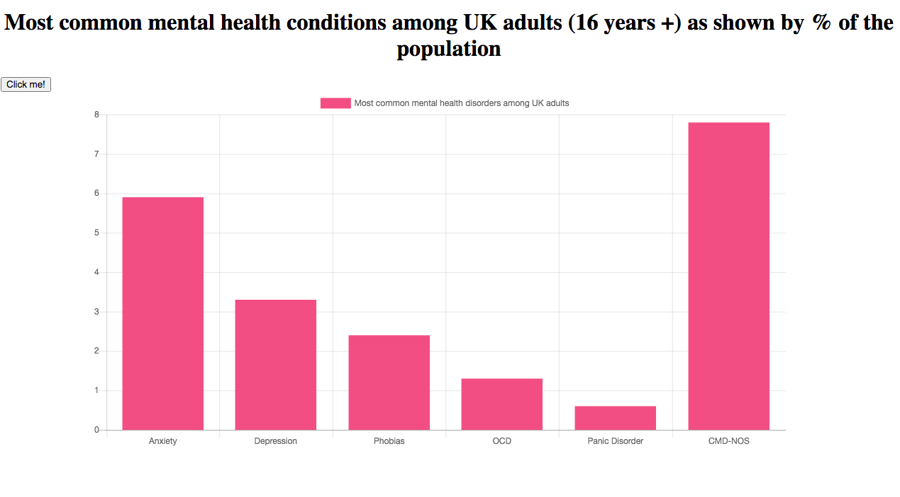
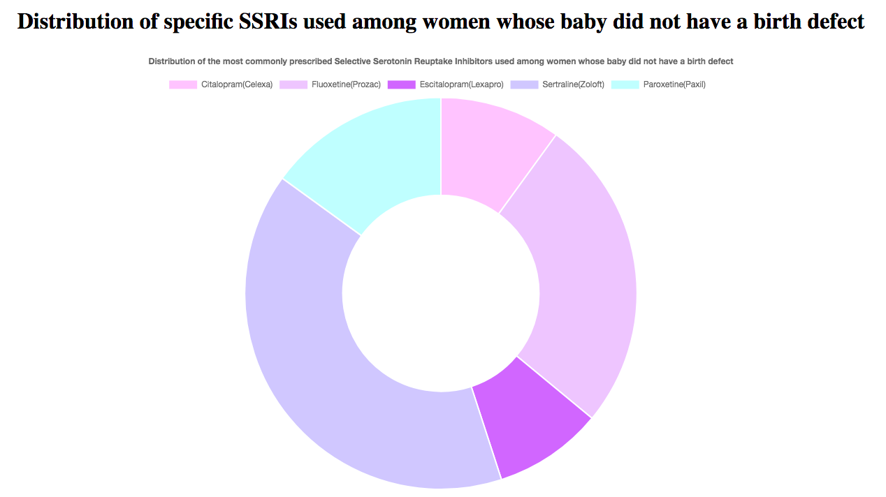
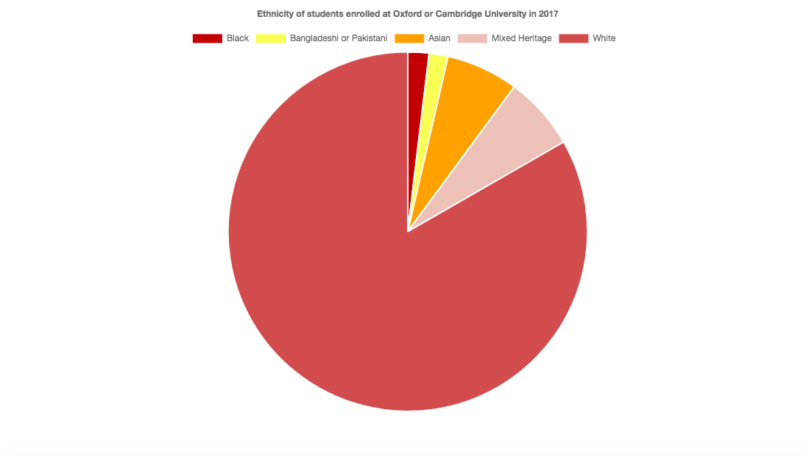
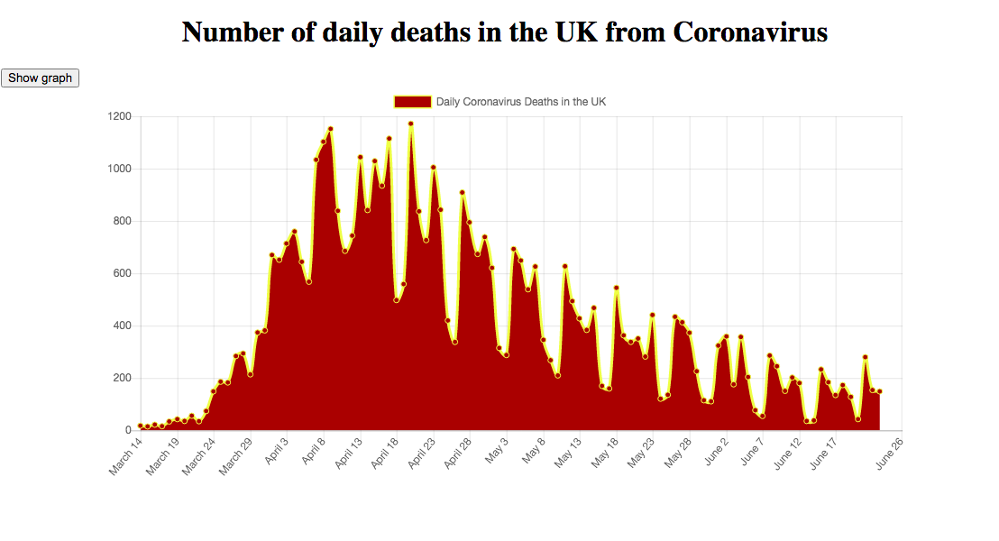
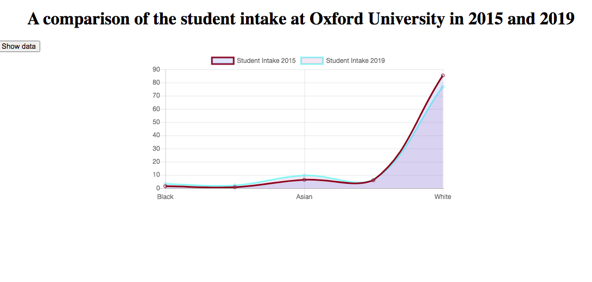
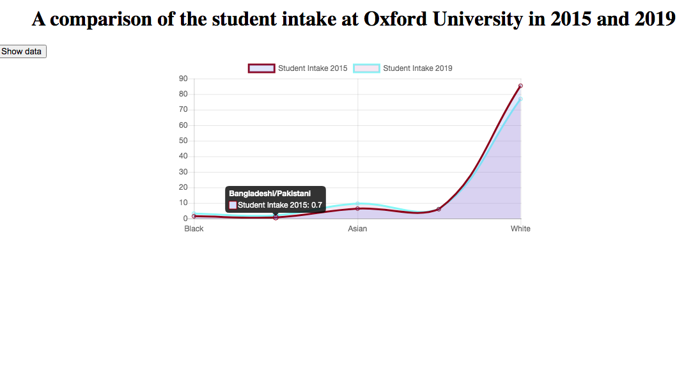

# Data Visualizations

An exploration of how to use Chart.js to create visualizations from data

### How to use:

* Clone this repo:
```html
git clone https://github.com/emilyjspencer/Data-Visualizations.git
```

* Cd into the repo on your computer
* Cd into the individual folders e.g. MentalHealth
* For all folders except Oxfordintake20172019, you can simply open the index.html file, click the button, and the graphs will appear
* With Oxfordintake20172019, run the following to install the dependencies:
```html
npm install
```
* Run the following to start the React application:
```html
npm start
```
* Go to:
```html
 localhost:3000/data
```


### Built with: 
* JavaScript
* Chart.js


### What it looks like:

Most common mental health conditions among UK adults:

The distribution of SSRIs taken among a selection of women who took part in a study

The ethnicities of students enrolled at the University of Oxford in 2017

The daily deaths from Coronavirus in the UK between March 14th and June 25th, 2020

A comparison of the ethnicities of students matriculating at the University of Oxford in 2015 and 2019


