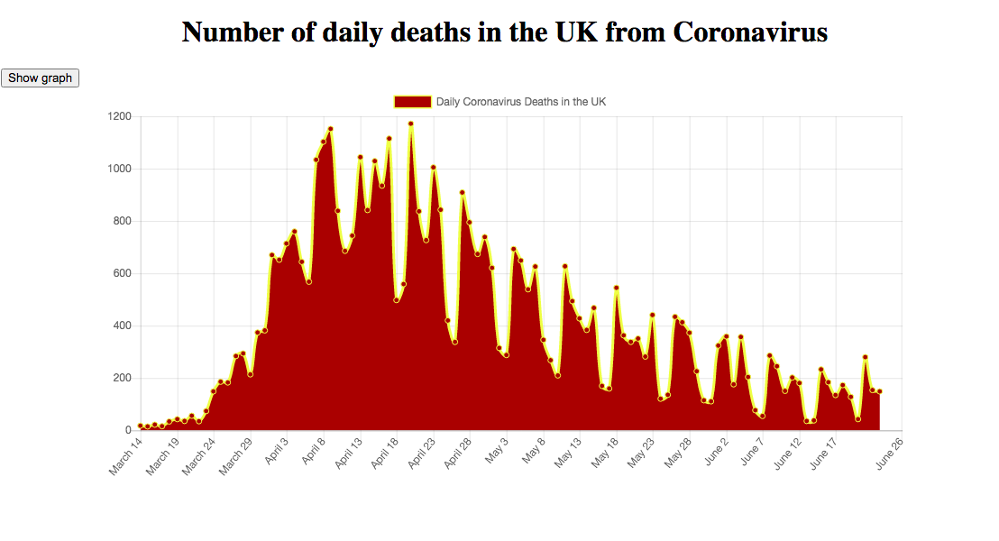

# Coronavirus Daily Deaths, UK

As of 27th June 2020, Covid-19 has claimed the lives of 490,494 people worldwide (World Health Organization)

The following line graph shows the number of daily deaths resulting from the Coronavirus in the United Kingdom, between March 14th and June 25th 2020. 

