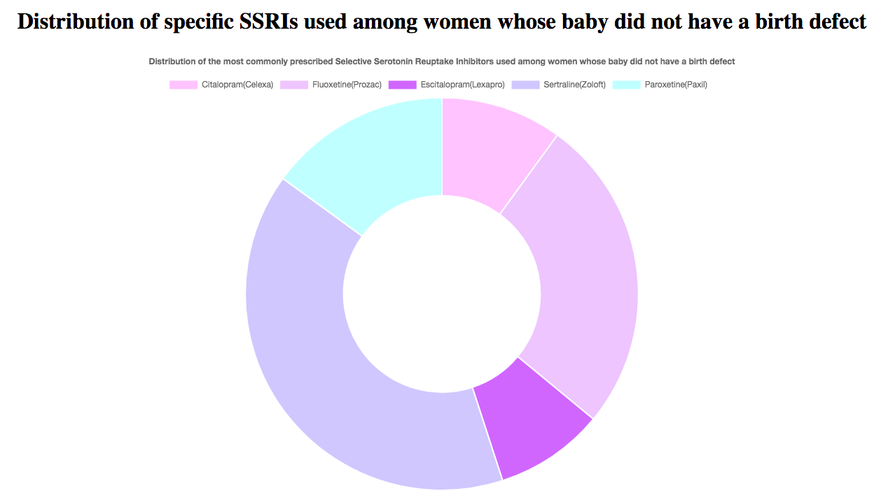

The following donut chart shows the distribution of the most commonly prescribed SSRIs (Selective Serotonin Reuptake Inhibitors), more commonly known as antidepressants, as used among women whose babies were born without birth defects.

This data comes from the National Birth Defects Prevention Study (NBDPS), one of the largest studies aimed at understanding factors that increase the risk for major birth defects in the United States.

